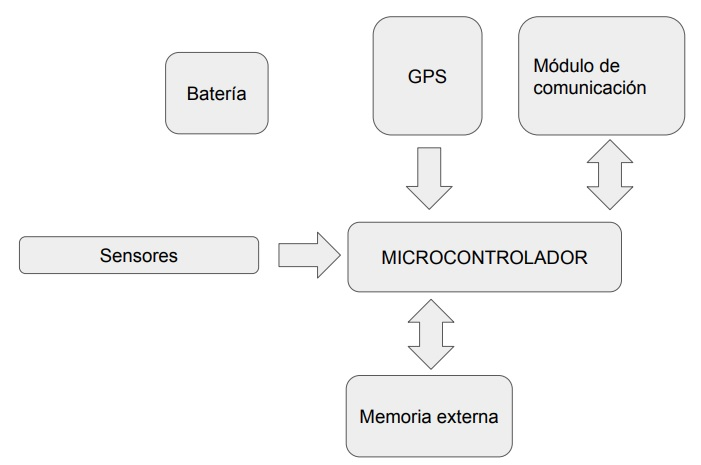

<h2>
    Trabajo final para la carrera de especialista en sistemas embebidos: 
    Sistema de telemetría para usos en investigación.
</h2>

## Alumno: German Velardez

### Breve resumen del proyecto a realizar:


<p>Se pretende diseñar el firmware de un drifter modular. La arquitectura del mismo debe tener una estructura en capas.
</p>


 <h4 align="center">Diagrama simple del sistema</h4>
 <div align="center" >

</div>

### Generar documentacion Doxygen

<p>Se necesita tener Doxygen instalado en su sistema. Para generar la documentacion del codigo ejeecute el siguiente codigo.</p>

```
    doxygen doc_config
 ```

